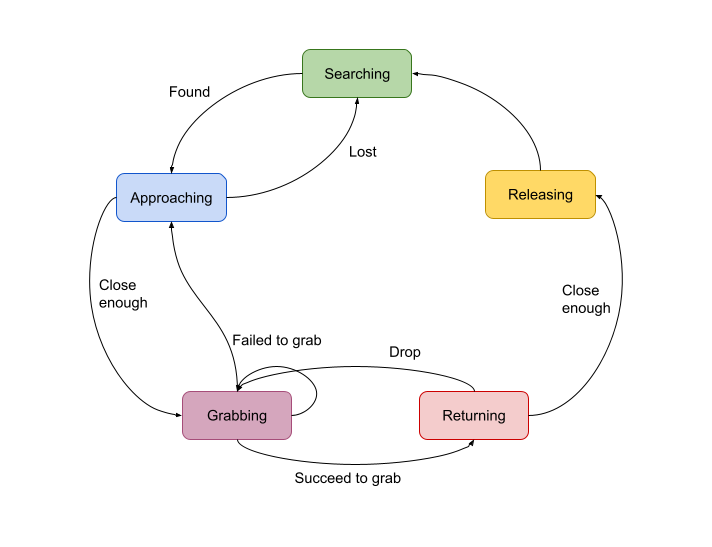

# Project

## Garbage collection by the Salamander Robot

### Modification

#### World
- add garbages

#### Salamander
- add camera
  - enables object detection

    

- add arms
  - grasp or sweep garbages

    

#### State machine
  - Searching - Look and walk around in random directions for garbage
  - Approacning - When some garbages are detected, walk toward the nearest one.
  - Grabbing - Grab garbage by arms.
  - Returning - Carry garbage to the collection point.
  - Releasing - Release garbage.

  

### Demo

https://user-images.githubusercontent.com/25011913/122124848-c90f2400-ce6a-11eb-82cd-68feb5a0631c.mp4


### How to use

#### Requirement
 - OpenCV
   ```
   Ubuntu 20.04
   $ sudo apt update
   $ sudo apt install libopencv-dev

   macOS
   $ brew install opencv
   ```

#### Build
  - check if the path of OpenCV is correct.
    `controllers/gc_salamander/Makefile`
    ```
    30: OPENCV_DIR := /usr/local
    ```

#### Run
  ```
  $ webots worlds/gc.wbt
  ```